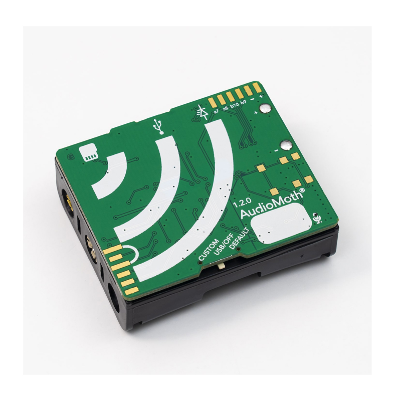
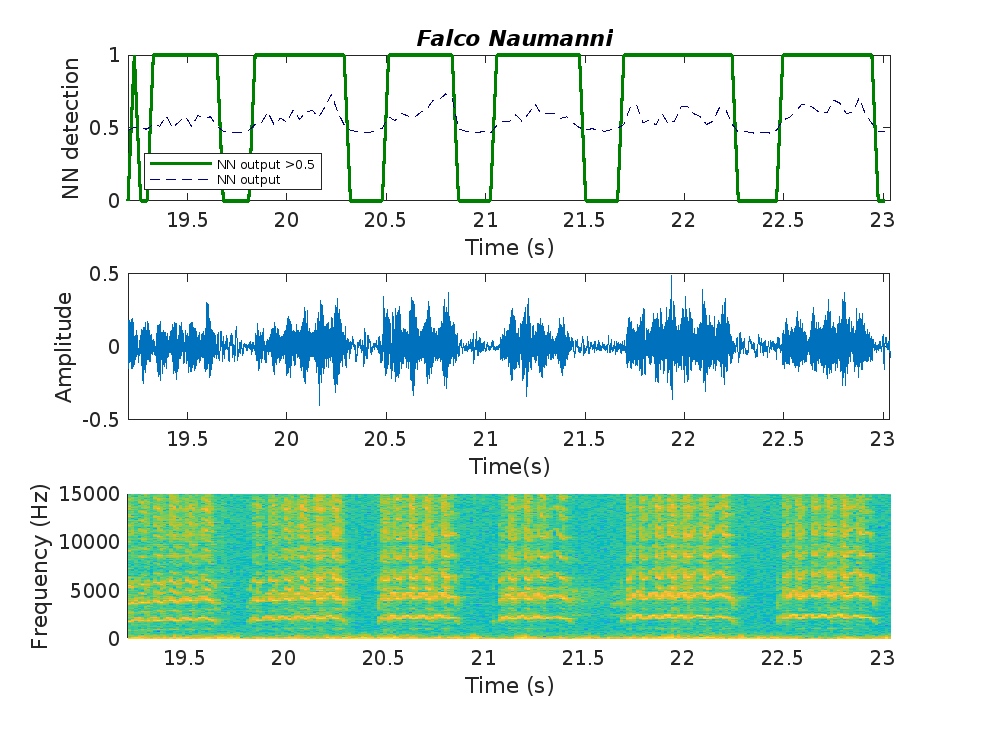

# On-device Falco naumanni presence detection

This repository contains MATLAB code and AudioMoth firmware modifications for detecting the presence of the _Falco naumanni_ species using audio recordings collected with AudioMoth device.  
The project integrates data curation, neural network training, and embedded implementation of the trained model on an AudioMoth device.

---

## Repository Structure

### 1. AudioMoth folder

This folder contains the modified AudioMoth firmware based on the [Open Acoustic Devices AudioMoth Basic Firmware v1.11.0](https://github.com/OpenAcousticDevices/AudioMoth-Firmware-Basic/tree/1.11.0) to be integrated in the [Open Acoustic Devices AudioMoth Project](https://github.com/OpenAcousticDevices/AudioMoth-Project).

The modifications of source code include:
- **`src/main.c`**: Updated to integrate the trained neural network for real-time classification of audio recordings.
- **`fatfs/inc/ffconf.h`**: Enable function `f_puts()`.
  
The modified firmware enables the AudioMoth to:
1. Record audio.
2. Process audio segments using the embedded neural network.
3. Output species presence detection results.

The built binary file `audiomoth_NN.bin`, ready to be flashed to the device, is also included.

---

## Usage

### a) Direct AudioMoth integration
1. Employ the [AudioMoth Flash App](https://www.openacousticdevices.info/applications) to flash the provided `audiomoth_NN.bin` into the AudioMoth device.
2. Once flashed, use the [AudioMoth Configuration App](https://www.openacousticdevices.info/applications) to configure the *Sample Rate* to 32 kHz, and also the desired *Recording period*.
  **Note**: to simplify the functionality, *Filtering* options are not allowed in this firmware.
3. Turn on the device into CUSTOM or DEFAULT mode. Deploy the device for field data collection and real-time species detection.
4. **(Optional)**: You can adjust the neural network detection threshold by placing the text file `NN_CONFIG.txt` - provided in this repository - on the SD card. Edit the line like this `NN_THRESHOLD=0.75` (for a threshold of 0.75) to customize detection sensitivity without modifying the firmware. Otherwise, if this file is not included in the SD card, default 0.5 detection threshold is employed.
5. The threshold value that is finally used by the firmware is logged to the `CONFIG.TXT` file for reference.

   
### b) Code compilation and AudioMoth Integration
Although option (a) is recommended,  you can build the code by yourself:
1. Replace the original source files in [Open Acoustic Devices AudioMoth Project](https://github.com/OpenAcousticDevices/AudioMoth-Project) with the modified files provided in this repository.
2. Download and integrate [ARM CMSIS-DSP software library](https://github.com/ARM-software/CMSIS-DSP/). Follow [Open Acoustic Devices AudioMoth Project](https://github.com/OpenAcousticDevices/AudioMoth-Project) instructions to compile the firmware.
3. Employ the [AudioMoth Flash App](https://www.openacousticdevices.info/applications) to flash it onto the AudioMoth device.
4. Once flashed, use the [AudioMoth Configuration App](https://www.openacousticdevices.info/applications) to configure the *Sample Rate* to 32 kHz, and also the desired *Recording period*.
  **Note**: to simplify the functionality, *Filtering* options are not allowed in this firmware.
5. Turn on the device into CUSTOM or DEFAULT mode. Deploy the device for field data collection and real-time species detection.

---

### 2. MATLAB Folder
This folder contains the code employed for preparing the dataset, training the neural network, and testing the model. Once the network is trained (which have already be done), this code is no needed for AudioMoth users. The primary files include:

- **`a_create_inputs_NN.m`**:  
  Reads audio segments from the dataset and generates feature vectors based on MFCC coefficients for training the neural network.

- **`b_trainNNmat.m`**:  
  Uses the feature vectors to train a shallow neural network.

- **`c_test_one_file.m`**:  
  Exemplifies the classification performance of the trained network with example data.
  
  
  
- **`c_test.m`**:  
  Evaluates the classification performance of the trained network over test dataset.

- **`NeuralNetworkFunction.m`**:  
  Contains the trained neural network.

- **Auxiliary Scripts**:  
  Additional `.m` files provide support functions for data processing, feature extraction, and other utilities.

- **Python Scripts**:
   - `test_one_file.py`: exemplifies the classification performance of the trained network with example data.  
   - `test_files.py`: executes NN inference over audio files in a specified folder, saving results into a `.txt` file.
   
### MATLAB Workflow employed
1. **Generate Feature Vectors**  
   Run `a_create_inputs_NN.m` to process the dataset and create input feature vectors for training.

2. **Train the Neural Network**  
   Execute `b_trainNNmat.m` to train a shallow neural network. The trained model is provided in `NeuralNetworkFunction.m`.

3. **Test the Neural Network**  
   Use `c_test_one_file.m` and `c_test.m` to validate the network's performance on audio data.
---

## Acknowledgements
- **AudioMoth Firmware**: Based on the [AudioMoth Basic Firmware](https://github.com/OpenAcousticDevices/AudioMoth-Firmware-Basic).
- **Open Acoustic Devices**: For their contributions to open-source acoustic monitoring technology.

